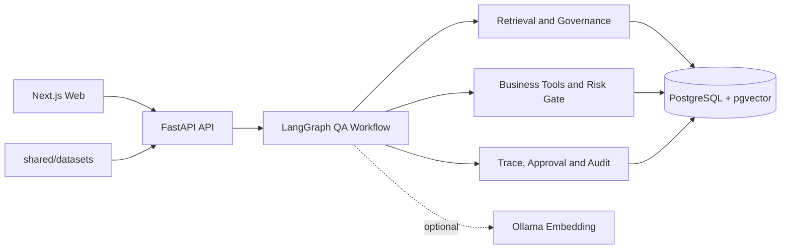
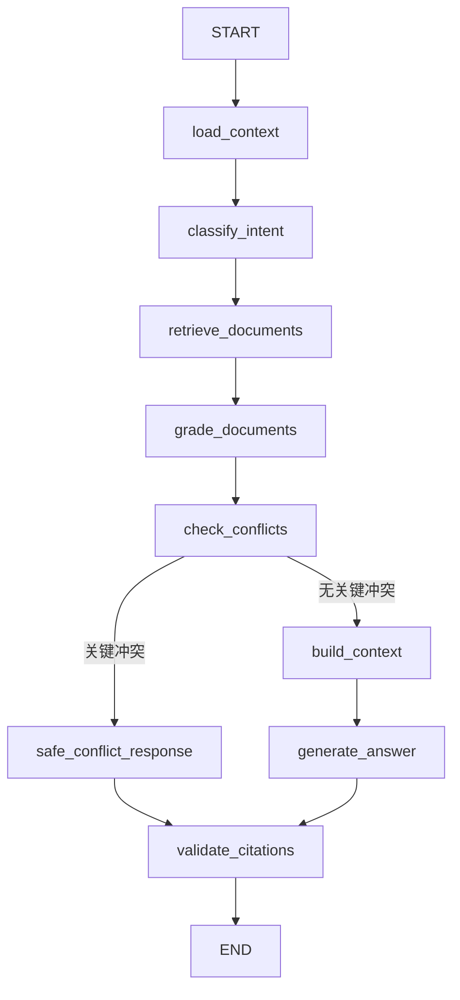
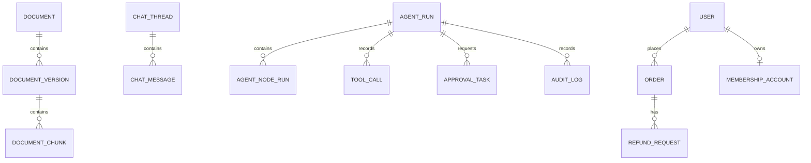

# Living RAG

面向电商售后政策的版本感知、冲突治理与安全审批 Agent。

Living RAG 处理售后政策持续更新过程中产生的版本混用、过期内容、来源冲突和高风险业务操作问题。

## 项目状态

当前发布版本：`living-rag-v0.1.1`

仓库当前重点是展示一个可启动、可测试、可追踪的 Living RAG 闭环。版本标签是否创建，以 Git 标签列表为准。

第一版 Living RAG MVP 已完成：

- 文档导入、版本管理和有效期治理；
- PostgreSQL/pgvector 当前有效政策检索；
- 带文档版本和原文 Chunk 的引用问答；
- 正式政策、FAQ 和临时公告的冲突检测；
- 冲突人工审核和文档失效；
- 订单、用户、会员和退款历史查询；
- Python 确定性退款资格判断；
- 直接退款、政策修改和文档删除的审批门控；
- 基于 `trace_id` 的运行详情、审批和审计关联；
- Docker Compose、数据迁移、Seed、文档导入和可复现演示。

`Agent Reliability Lab` 是后续阶段。当前仓库已包含共享任务集，但评测应用、批量运行器、LLM Judge、故障注入和回归报告尚未完成。

## 数据声明

本项目中的用户、订单、会员、政策和评测任务均为合成演示数据，不包含真实客户信息、生产订单或真实业务凭据。项目不连接真实支付、订单或 CRM 系统。

```text
All users, orders, policies, and evaluation cases in this repository are synthetic demo data.
```

## 核心架构



### LangGraph 问答流程



核心安全边界：

- LLM 负责自然语言理解和结构化回答；
- Python 规则服务负责退款资格判断；
- 高风险动作必须进入人工审批；
- 引用必须对应真实文档 Chunk；
- 过期、失效和待审核文档不能作为当前政策依据。

## 技术栈

| 领域 | 技术 |
| --- | --- |
| API | Python、FastAPI、Pydantic |
| Agent | LangGraph、LangChain Core |
| 数据库 | PostgreSQL 16、pgvector、SQLAlchemy |
| 文档和迁移 | Markdown/TXT 解析、Alembic |
| 前端 | Next.js、React、TypeScript |
| 工程化 | Docker Compose、pytest |
| Embedding | Mock、Ollama、OpenAI-compatible Provider |

## 快速启动

### 环境要求

- Windows 10/11、macOS 或 Linux；
- Docker Desktop 或 Docker Engine；
- Docker Compose v2；
- 可选：Ollama 和 `nomic-embed-text`。

### 创建本地配置

```powershell
Copy-Item .env.example .env
```

默认配置使用 Mock Embedding，因此基础演示不依赖 Ollama。需要真实 Embedding 时，将 `.env` 中的配置改为：

```text
EMBEDDING_PROVIDER=ollama
OLLAMA_BASE_URL=http://host.docker.internal:11434
EMBEDDING_MODEL=nomic-embed-text
```

`.env` 只用于本地运行，不要提交到 Git；`.env.example` 只包含示例值。

### 启动服务

```powershell
docker compose config --quiet
docker compose up --build -d
docker compose ps
```

首次启动会创建 PostgreSQL 数据卷。需要重新验证“从空数据库启动”的流程时，确认本地数据可以删除后执行：

```powershell
docker compose down -v
docker compose up --build -d
```

`docker compose down -v` 会删除本地 PostgreSQL 数据，只用于明确的数据重置场景。

健康检查：

```powershell
Invoke-RestMethod `
  -Uri "http://localhost:8000/health" `
  -Method Get
```

访问地址：

```text
API 文档：http://localhost:8000/docs
Web：http://localhost:3000
```

### 初始化数据库和样例数据

```powershell
docker compose exec -T api alembic upgrade head
docker compose exec -T api python "/app/scripts/prepare_demo_data.py"
```

`prepare_demo_data.py` 会幂等执行用户、会员、订单和退款历史 Seed，导入样例政策文档，同步检索使用的 `policy_key`，把样例版本映射到可检索的治理状态，并为缺失的文档 Chunk 生成 Embedding。默认使用确定性的 Mock Embedding，不需要安装 Ollama。

如需单独执行底层步骤，也可以使用：

```powershell
docker compose exec -T api python "/app/scripts/seed_database.py"
docker compose exec -T api python "/app/scripts/ingest_sample_documents.py"
```

当前样例数据包括：

```text
20 个用户、20 个会员账户、40 个订单、6 条退款历史
6 个样例文档、8 个文档版本、56 个文档 Chunk
```

文档导入会同步 `policy_key`、版本治理状态、有效期和版本链，并为尚未有向量的 Chunk 生成 Embedding。默认使用 Mock Embedding，因此基础演示不依赖 Ollama。

Seed 和文档导入脚本支持重复执行。样例文档位于 `data/sample_documents/`，共享任务集位于 `shared/datasets/`。

## 快速演示

完整演示脚本：[docs/living-rag-demo-script.md](docs/living-rag-demo-script.md)

```text
当前政策问答
  -> 展示版本、治理状态和引用 Chunk
  -> 查询订单和会员退款资格
  -> 请求直接退款
  -> 创建人工审批任务
  -> 查看审批和审计日志
  -> 使用 trace_id 查询运行详情
```

### 主要 API

| 方法 | 路径 | 用途 |
| --- | --- | --- |
| `POST` | `/api/chat` | 运行带引用的政策问答 |
| `GET` | `/api/users` | 获取演示用的有效合成用户列表 |
| `POST` | `/api/business-actions` | 查询退款资格或创建高风险审批 |
| `POST` | `/documents/upload` | 上传文档并登记版本 |
| `GET` | `/documents/{policy_key}/versions` | 查询文档版本 |
| `POST` | `/api/retrieval/search` | 执行带治理过滤的检索 |
| `GET` | `/approval-tasks` | 查询审批任务 |
| `POST` | `/approval-tasks/{task_id}/decision` | 提交审批决定 |
| `GET` | `/audit-logs` | 查询审计日志 |
| `GET` | `/runs/{trace_id}` | 查询一次运行的完整详情 |

注意：当前 API 路由沿用了已有模块边界，部分资源使用 `/api` 前缀，文档、审批、审计和运行详情路由使用无前缀路径。以 `/docs` 中的实际注册结果为准。

问答响应包含 `answer`、`conditions`、`citations`、`citation_valid`、`confidence`、`limitations` 和 `trace_id`。

一次运行可以通过 `trace_id` 关联：

```text
AgentRun
AgentNodeRun
ToolCall
ChatMessage
ApprovalTask
AuditLog
```

直接退款不会被系统自动执行，而是返回待处理的人工审批任务。

## 数据模型



文档治理核心字段：

```text
policy_key
version_number
governance_status
effective_at
expires_at
supersedes_version_id
content_hash
```

## 测试

全新环境第一次运行测试前，先确保独立测试数据库存在：

```powershell
docker compose exec -T api python "/app/scripts/ensure_test_database.py"
```

这个命令可以重复执行，已存在时不会删除或重建数据库。
运行后端全量测试：

```powershell
docker compose exec -T api python -m pytest "/app/tests" -q
```

当前验证结果：

```text
300 passed, 2 warnings
```

测试覆盖文档、Embedding、pgvector 检索、政策规则、冲突检测、人工审核、退款资格、审批、审计、Trace、运行详情、任务 Schema 和 JSON/JSONL 加载。

上述结果是在 Docker Compose 的 API 容器中执行的，不能等同于生产环境的性能、可用性或安全认证测试。

## 共享任务集

当前包含 71 条结构化任务，覆盖：

```text
正常政策问答、版本和过期内容、冲突问题、订单会员资格、
高风险操作、多轮对话、故障注入和对抗任务
```

任务 Schema 和加载器：

```text
apps/living-rag-api/app/schemas/agent_task_case.py
apps/living-rag-api/app/services/task_dataset_loader.py
```

## 风险控制

- LLM 不直接裁定退款资格，资格判断由 Python 确定性规则完成；
- 直接退款、政策修改和文档删除必须经过人工审批；
- 审批决定保留审批人、理由和时间；
- 审批、审计、用户消息和 Agent Run 通过 `trace_id` 关联；
- 引用必须对应真实文档 Chunk；
- 检索为空时保守回答，不编造业务结论；
- 工具失败、超时或权限拒绝时不猜测业务数据。

## 已知限制

- 当前使用合成业务数据，不连接真实支付、订单或 CRM；
- 默认使用 Mock Embedding，不依赖 Ollama；
- 当前使用 Mock LLM，不代表生产级模型质量；
- 部分业务动作链路尚未统一持久化节点级 ToolCall；
- 当前没有复杂 RBAC、Redis、Celery、Nginx 和生产级任务队列；
- 前端定位为项目演示界面，不是生产级运营后台；
- 项目目标是可运行、可验证、可解释的 MVP，不宣称生产级全功能平台。

## 项目目录

```text
apps/living-rag-api/       FastAPI、LangGraph、RAG 和业务服务
apps/living-rag-web/       Next.js 前端
data/sample_documents/     合成样例用户、订单和政策数据
shared/datasets/            共享 Agent 任务集
docs/                       数据库设计和演示脚本
infra/postgres/             PostgreSQL 初始化脚本
docker-compose.yml          Docker 服务编排
.env.example                配置模板
LICENSE                     MIT License
```

## 从零开始的最短路径

如果只想快速验证项目是否能运行，可以按以下顺序执行：

```powershell
Copy-Item .env.example .env
docker compose up --build -d
docker compose exec -T api alembic upgrade head
docker compose exec -T api python "/app/scripts/prepare_demo_data.py"
docker compose exec -T api python "/app/scripts/ensure_test_database.py"
docker compose exec -T api python -m pytest "/app/tests" -q
```

之后打开 `http://localhost:3000`，或访问 `http://localhost:8000/docs` 调用 API。需要完整业务演示时，继续执行 [Living RAG 完整演示脚本](docs/living-rag-demo-script.md)。

## 相关文档

- [数据库设计](docs/database-schema.md)
- [完整演示脚本](docs/living-rag-demo-script.md)

## License

本项目使用 [MIT License](LICENSE)。
